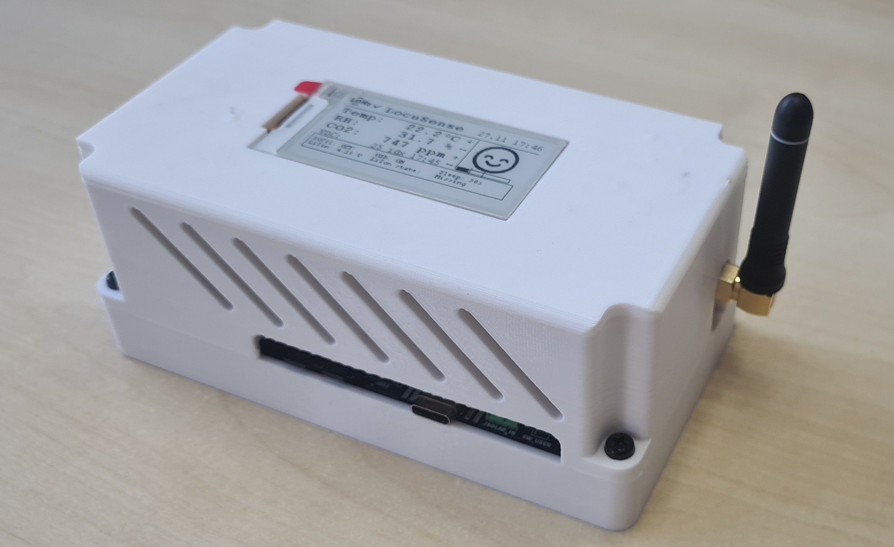
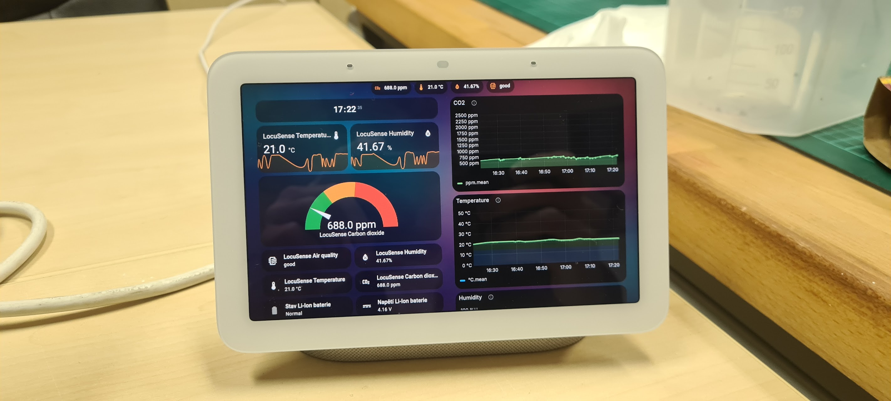

# LocuSense – Low-Power CO₂ / T / RH / VOC Node (LoRaWAN / Matter over Thread)

LocuSense is a **battery-powered environmental sensing node** for CO₂, temperature, humidity and VOC index.
It is built around an ultra-low-power **STM32U0** MCU and can be equipped with **one of two mutually exclusive
communication modules**:

- **LoRaWAN (Wio-E5)** – long-range, ultra-low-power operation (few µA sleep current)
- **ESP32-C6 (Matter over Thread)** – fully integrated with Home Assistant as a sleepy end device (SED)

A 2.13" e-ink display shows current air quality and device status. It can be safely omitted in
long-life, headless deployments where every µA matters.


---


## Features

### Sensing

- **CO₂** – Sensirion **SCD41**
- **Temperature & humidity** – Sensirion **SHT41**
- **VOC index** – Sensirion **SGP40** with official Gas Index Algorithm (VOC index)

### Power & batteries

- **STM32U0** ultra-low-power MCU
- Designed for **very low standby current** (few µA in LoRa STOP2 mode):
  - Switchable sensor / RF / e-ink power rails
  - Switchable pull-ups and resistor dividers
  - Deep sleep of external radios (Wio-E5 sleep, ESP32-C6 SED + light sleep)
- Dual battery support:
  - **LiSOCl₂ primary cell** for **multi-year, maintenance-free deployments**
  - **Li-Ion** secondary cell with **USB-C charging** via **BQ25185**
- Both batteries are measured via ADC and reported to the GUI and (for ESP32-C6) via
  **Matter Power Source cluster** (USB + Li-Ion + LiSOCl₂ endpoints).

> **Note:** The design does **not enforce a single “primary” source**. Which battery you use depends
> on your application profile (see [Typical use cases](#typical-use-cases)).

### Communication (choose one module per board)

- **LoRaWAN module – Seeed Wio-E5**
  - Configurable OTAA keys (AppEUI, DevEUI, AppKey, ADR flag)
  - Integration with **The Things Network (TTN)**
  - 6-byte payload: **T(0.01°C), RH(0.01%), CO₂ ppm**
  - Example **MQTT → Node-RED → Home Assistant** flow provided
- **ESP32-C6 module – Matter over Thread**
  - Thread sleepy end device (SED)
  - Exposes:
    - **TemperatureMeasurement cluster**
    - **RelativeHumidityMeasurement cluster**
    - **AirQuality cluster** (mapped from CO₂)
    - **Custom CO₂ concentration cluster** (0x040D, MEA feature)
    - **Power Source cluster** for USB, Li-Ion, LiSOCl₂
  - Text-based UART protocol between STM32 and ESP32-C6 (DATA / STATUS / COMM / QR …)

Only one of these modules is populated and connected to the RF connector; firmware detects the
configured communication mode and drives either **LoRaWAN** or **Matter** with no code changes
on your side.

### Local UI – e-ink display

- 2.13" e-ink (Waveshare / Good Display, `EPD_2in13_V4`)
- Shows:
  - CO₂ (ppm) + compact gauge with thresholds
  - Temperature and RH with tiny trend arrows
  - VOC index (when USB + VOC mode are enabled)
  - Connection state (LoRa or Matter)
  - Battery voltages (LiSOCl₂, Li-Ion), USB and charger status
  - Current sleep interval
- Uses **change-based refresh policy**:
  - Full redraw only when a **significant change** occurs
  - Small partial refreshes for state line and VOC updates
  - This minimizes e-ink wear and **saves power**, not just network traffic


### Home Assistant integration

- **Home Assistant Green + SkyConnect configured for Thread** (used in development)
  - LocuSense appears as a Matter device with multiple sensors and power sources
  - Ready-to-use HA dashboard configuration included
- Data flow options:
  - **Matter over Thread (ESP32-C6)** – native Matter device
  - **LoRaWAN via TTN → (MQTT → Node-RED → Home Assistant)** - in my example
- For detailed Home Assistant walkthroughs see:
  - [Matter over Thread integration guide](home-assistant/matter/README.md) – commissioning, dashboard YAML, InfluxDB / Grafana embedding.
  - [LoRaWAN → MQTT → Node-RED → Home Assistant guide](home-assistant/lora/README.md) – TTN setup, payload decoding, Node-RED flows and dashboards.

### Data storage & analytics

- Example stack:
  - **InfluxDB** for time-series storage
- **Grafana** dashboards for CO₂ / T / RH / VOC trends
- Sample dashboard JSON is provided.


## Documentation map

Use these focused guides for deeper dives:

- [Firmware – STM32U0 (LoRaWAN + orchestration)](firmware/stm32/README.md): state machine, configuration console and EEPROM layout.
- [Firmware – ESP32-C6 bridge (Matter over Thread)](firmware/esp32c6/README.md): ESP-Matter Sleepy End Device, UART protocol and commissioning helpers.
- [Home Assistant – Matter over Thread integration](home-assistant/matter/README.md): Thread network prep, commissioning, dashboards and Grafana embedding.
- [Home Assistant – LoRaWAN → TTN → MQTT → Node-RED pipeline](home-assistant/lora/README.md): OTAA provisioning, payload decoder, Node-RED flow and HA dashboards.



---

## Typical use cases

LocuSense is intentionally designed for two main scenarios:

### 1. Long-term building monitoring (LoRaWAN + LiSOCl₂)

- Application: schools, offices, public buildings, multi-room deployments
- Recommended configuration:
  - **Battery:** LiSOCl₂ primary cell
  - **Radio:** Wio-E5 (LoRaWAN → TTN → MQTT → ...)
  - **Display:** e-ink optionally **not populated** (headless sensors in classrooms, corridors)
  - **VOC:** disabled to minimize current consumption
- Example timing:
  - `measure_mode = CO₂+T+RH`
  - `interval_measure_sec = 3600` (measure **once per hour**)
  - `interval_sleep_sec   = 3600` (sleep until next cycle)
  - `tx_min_interval_sec  = 3600` (one update per measurement)
  - `tx_max_interval_sec  = 21600` (heartbeat every 6 h)

These settings are tuned for **multi-year battery life** on LiSOCl₂ while still providing useful
CO₂ and comfort trends.

### 2. Personal air-quality monitor (Matter + Li-Ion + e-ink)

- Application: desks, home office, bedrooms, meeting rooms
- Recommended configuration:
  - **Battery:** Li-Ion (rechargeable) + occasional USB-C top-up
  - **Radio:** ESP32-C6, Matter over Thread, paired to Home Assistant
  - **Display:** e-ink populated, always showing the current status
  - **VOC:** continuous VOC index when USB is present
- Example timing:
  - `measure_mode = CO₂+T+RH`
  - `interval_measure_sec = 900` (measure every **15 minutes**)
  - `interval_sleep_sec   = 900`
  - `tx_min_interval_sec  = 900` (one update per measurement)
  - `tx_max_interval_sec  = 3600` (heartbeat every hour)

Even in this “personal gadget” mode the device still aims to be **low-power**. It does **not**
need to be permanently powered via USB—USB is mainly for charging and optional continuous VOC
sampling.

---

## Getting started

1. Decide which RF module you will populate (Wio-E5 for LoRaWAN, ESP32-C6 for Matter).
2. Provision the matching firmware and configuration:
   - LoRaWAN: flash the STM32 image, set OTAA keys via the UART console, and pair with TTN.
   - Matter: flash the STM32 image plus the ESP32-C6 image, then commission the Matter device
     using the QR/manual codes.
3. Adjust measurement and transmission intervals in CONFIG mode to fit your deployment (see the
   [typical use cases](#typical-use-cases)).
4. Confirm data flow in your backend (MQTT/Node-RED/Home Assistant or Matter controller) before
   sealing the enclosure.

---

## Repository structure

Current top-level layout:

```text
.
├── .vscode/                   # Editor tasks/snippets
├── docs/
│   └── images/                # Photos and screenshots used in the README
├── firmware/
│   ├── esp32c6/               # ESP-Matter (Thread) bridge
│   └── stm32/                 # STM32U0 application, GUI, and drivers
├── hardware/                  # Altium Designer sources, and PCB outputs
├── home-assistant/            # HA dashboards, TTN/Node-RED helpers, Matter guide
└── README.md
```

Each firmware directory also ships with its own README that dives into the UART protocol,
state machine, and build/flash steps.

---

## Configuration & EEPROM (M24C02)

Each **communication module** (LoRaWAN Wio-E5 carrier or ESP32-C6 carrier) includes its own
**M24C02 I²C EEPROM**. That EEPROM holds everything the node needs to know about:

- which communication stack to use, and
- how it should behave in the field.

Stored data:

- **Device config (`AppConfig`)**
  - Measurement mode (CO₂+T+RH vs T+RH only)
  - VOC mode (disabled vs continuous on USB)
  - Communication mode (OFFLINE / LoRa / Matter)
  - Measurement / sleep / time-sync / battery intervals
  - TX thresholds for CO₂, T, RH
- **LoRaWAN (Wio-E5) OTAA credentials**
  - AppEUI, DevEUI, AppKey, ADR flag
- **ESP32-C6 pairing data**
  - Last Matter QR string
  - Manual pairing code

On every **cold boot**, the STM32:

1. Powers the sensor and RF rails.
2. Enables I²C pull-ups.
3. Probes the attached communication module and reads its **M24C02** over I²C.
4. Loads `AppConfig`, LoRa keys or ESP pairing data from that EEPROM.
5. Initializes **either** Wio-E5 **or** ESP32-C6 depending on the stored `comms_mode`.

This means you can **pre-provision communication modules** (configure once via the console
and `SAVE`), and then plug them into any LocuSense base board. The module carries its own
configuration with it; on boot, the STM32 simply reads the M24C02 and starts communication
and housekeeping according to those parameters.

---

## UART configuration console (USART4 over USB‑to‑UART)

A minimal interactive configuration console is available on **USART4**, which is routed
through the on-board **USB‑to‑UART bridge** to the USB‑C connector. In practice you just
plug the node into a PC and open a serial terminal (e.g. **Tera Term**, PuTTY, minicom)
with the parameters below while the device is in **CONFIG mode**.

- **Baud:** `115200`
- **Data bits:** 8
- **Parity:** none
- **Stop bits:** 1
- **Recommended TX delay:** **≥ 5 ms/char** in your terminal to avoid overrunning the parser.
- Console starts when you **hold the button for ≥ 5 s** (see [Button functions](#button-functions)).

Basic commands (non-exhaustive):

- `HELP` – print help and command summary
- `SHOW` – print current device config, Wio-E5 keys and ESP32-C6 status/QR/manual
- `SET <key> <value>` – change device-level config (measurement intervals, thresholds, modes…)
- `RESET` – restore firmware defaults for `AppConfig` in RAM
- `SAVE` – store current `AppConfig`, Wio OTAA keys and ESP pairing data to EEPROM (M24C02) on the module
- `EXIT` – leave CONFIG mode (same as a second ≥5 s button hold or inactivity timeout)

Supported `SET <key> <value>` options (mirrors `Core/Src/conf_console.c`):

| Key (alias)                  | Allowed values / units                                                                 | Purpose                                                                                  |
|-----------------------------|-----------------------------------------------------------------------------------------|------------------------------------------------------------------------------------------|
| `measure_mode` (`mm`)       | `0` = CO2+T+RH, `1` = T+RH only                                                         | Pick which sensors run each cycle.                                                       |
| `voc_mode` (`voc`)          | `0` = disabled, `1` = VOC only when USB power is present                                | Gate VOC sampling to save power on battery.                                              |
| `comms_mode` (`comms`)      | `0` = offline GUI, `1` = LoRaWAN (Wio-E5), `2` = Matter over Thread (ESP32-C6 build)    | Select the radio backend that the STM32 should drive.                                    |
| `interval_measure_sec` (`tm`)| Seconds                                                                                | Measurement cadence (CO2/T/RH or T/RH).                                                  |
| `interval_sleep_sec` (`ts`) | Seconds                                                                                 | STOP2 sleep duration between measurement cycles (when VOC is idle).                      |
| `interval_time_req_sec` (`tt`)| Seconds (`0` disables)                                                                | LoRaWAN network time-sync interval.                                                      |
| `interval_bat_sec` (`tb`)   | Seconds                                                                                 | Battery/USB/charger measurement cadence.                                                 |
| `tx_min_interval_sec` (`txmin`)| Seconds                                                                              | Minimum spacing between radio uplinks.                                                   |
| `tx_max_interval_sec` (`txmax`)| Seconds (`0` disables heartbeat)                                                      | Maximum silence before forcing a heartbeat uplink.                                       |
| `th_temp_01C` (`dT`)        | Delta in 0.01 °C (e.g. `20` = 0.20 °C)                                                  | Temperature change threshold that triggers TX/GUI updates.                               |
| `th_rh_01pct` (`dRH`)       | Delta in 0.01 %RH (e.g. `100` = 1.00 %RH)                                               | Humidity change threshold.                                                               |
| `th_co2_ppm` (`dCO2`)       | Delta in ppm (e.g. `50`)                                                                | CO2 change threshold.                                                                    |

> Enter the numeric value when using `SET`, e.g. `SET comms_mode 2` selects Matter over Thread and `SET comms_mode 1` selects LoRaWAN.

### LoRaWAN-related console commands

- `WIO SHOW` – show current AppEUI / DevEUI / AppKey / ADR
- `WIO SET APP_EUI <16hex>`
- `WIO SET DEV_EUI <16hex>`
- `WIO SET APP_KEY <32hex>`
- `WIO SET ADR <0|1>`
- `WIO JOIN` – perform an immediate OTAA join
- `WIO SEND HEX <12hex>` / `WIO SENDU HEX <12hex>` – confirmed / unconfirmed uplink
- `WIO SEND KV T=<i16> RH=<u16> CO2=<u16>` – build a 6-byte payload from values and send
- `WIO TIME` – request current UNIX time over LoRaWAN. A TTN + Node‑RED flow decodes the
  uplink and returns a 4‑byte timestamp which is then written into the STM32 RTC.

### ESP32-C6 / Matter-related console commands

- `ESP PING` – check the UART link to ESP32-C6
- `ESP STATUS` – query current status (`STATUS ONLINE role=SED` or `STATUS OFFLINE`)
- `ESP VERSION` – print firmware/version info
- `ESP QR` – request Matter QR & manual pairing codes
  - Text is printed on UART **and** a QR code is drawn on the e-ink display.
- `ESP COMM START` – open a Matter commissioning window
  - Device responds with `COMM STATE ...` and QR data; QR is also rendered on e-ink.
- `ESP COMM STOP` – close the commissioning window
- `ESP FABRICS` – list stored fabrics/controllers
- `ESP FACTORYRESET` – factory-reset the ESP32-C6 (clears fabrics/commissioning info)
- `ESP SEND HEX <12hex>` / `ESP SEND KV ...` – send a 6-byte payload via Matter text frame

The ESP32-C6 firmware also emits progress/status messages back over UART (`COMM STATE ...`,
`COMM DONE`, `COMM TIMEOUT`, etc.), which you can see in your terminal when commissioning
the device.

---

## Transmission & e-ink update policy (power-oriented)

To **save energy** (and not only to avoid spamming the network), both radio transmissions
and e-ink updates are **event-driven**:

### Radio TX (LoRa / Matter)

A new payload is sent only when all of these conditions are satisfied:

- Communication mode is `COMMS_LORA` or `COMMS_MATTER` (not OFFLINE)
- A baseline payload exists (first measured packet always sets it)
- **Minimum TX interval** has elapsed since the last uplink
- **At least one threshold** is exceeded compared to the last sent payload:
  - |ΔT| ≥ `th_temp_01C` (0.01 °C units)
  - |ΔRH| ≥ `th_rh_01pct` (0.01 %RH units)
  - |ΔCO₂| ≥ `th_co2_ppm` (ppm)
- Or the **heartbeat** interval `tx_max_interval_sec` has elapsed (periodic refresh)

You can tune these thresholds in CONFIG mode using `SET` commands, for example:

```text
SET dT 20       # 0.20 °C
SET dRH 100     # 1.00 %RH
SET dCO2 50     # 50 ppm
```

### E-ink redraw

The e-ink is **not** refreshed on every wake-up. A full GUI redraw happens when:

- The panel was blank (first boot)
- Communication state changes (connected / disconnected)
- USB plug/unplug, charger status, battery presence or voltage change (above hysteresis)
- Main measurable values change beyond TX thresholds or cross “emoji buckets”
  (CO₂ bands 800 / 1200 / 2500 ppm, temperature bands 15 / 35 °C)

Between full redraws, only tiny partial regions are updated:

- State line at the bottom (current FSM state)
- VOC line when new VOC index samples are available

This significantly reduces e-ink wear and display power consumption.

---

## Button functions

The front button is multi-function and time-based:

- **Short press**  
  Wake the node from STOP2 sleep (LoRa mode) and force a measurement/UI refresh.

- **Hold ≥ 5 s — enter/exit CONFIG mode**  
  - Enters the UART configuration console on `USART4` at **115200 8N1**.  
  - You can also leave CONFIG mode with the `EXIT` command or by another ≥ 5 s hold.  
  - For reliable input, set your terminal transmit delay to **≥ 5 ms/char**.

- **Hold 15–29 s — force SCD41 recalibration to 400 ppm**  
  - 400 ppm is the **typical CO₂ concentration in fresh outdoor air**.  
  - Recommended procedure:
    1. Take the device to **clean outdoor air** (away from people, traffic, exhausts).
    2. Let it **stabilize for at least 15 minutes** in that environment.
    3. Then press and hold the button for **15–29 s** to trigger the recalibration.
  - For most installations, doing this **about once per year** is sufficient,
    or whenever you suspect the CO₂ reading has drifted.

- **Hold ≥ 30 s — full system reset**  
  - Triggers a system reset of the STM32.  
  - Configuration stored in the M24C02 EEPROM (measurement config, LoRa keys, ESP pairing)
    is **preserved** unless explicitly cleared in firmware.

---

## LoRaWAN → TTN → Home Assistant example

For LoRa deployments, the node talks to a **Wio-E5** module using a simple AT-style driver.

- OTAA join is handled automatically on boot and on recover.
- Example integration flow:
  1. Wio-E5 joins **The Things Network (TTN)**.
  2. TTN pushes uplinks to **MQTT**.
  3. A **Node-RED** flow (provided) decodes the 6-byte payload into CO₂ / T / RH values.
  4. Node-RED publishes these as **Home Assistant MQTT sensors** (via discovery or HA add-on).

Additionally, a small TTN + Node-RED helper flow is used for **time synchronisation**: the
node sends a dedicated uplink, Node-RED calculates the current UNIX timestamp and returns
it as a 4‑byte downlink payload. The firmware parses this frame and updates the STM32 RTC
so logged samples carry a real wall‑clock time.

An example Node-RED flow is provided in [`home-assistant/lora/lora_ttn_ha_flow.json`](home-assistant/lora/lora_ttn_ha_flow.json),
while the TTN payload decoder lives alongside the Home Assistant YAML under [`home-assistant/lora`](home-assistant/lora/).


---

## Matter over Thread – Home Assistant & Google Nest Hub

With the ESP32-C6 module populated and `comms_mode = COMMS_MATTER`, the device acts as a
**Matter over Thread sleepy end device**:

- Tested with **Home Assistant Green + SkyConnect** (SkyConnect configured as Thread border router).
- Exposes:
  - Temperature, humidity, air quality (from CO₂)
  - CO₂ concentration cluster (0x040D, MEA)
  - Power Source info for USB, Li-Ion and LiSOCl₂

Pairing workflow:

1. Enter CONFIG mode and run `ESP COMM START` **or** `ESP QR` in the console.  
   The device prints the **QR and manual pairing code** and also draws the QR on the e-ink display.
2. In Home Assistant, add a new **Matter** device and scan the QR code.
3. After commissioning, all sensors appear in HA; you can then import the example dashboard.

For a step-by-step walkthrough (Thread network prep, dashboards, Grafana embedding), see
[`home-assistant/matter/README.md`](home-assistant/matter/README.md).


### Google Nest Hub

The same Matter endpoint can in principle be paired with a **Google Nest Hub**. However,
support for some clusters (especially custom CO₂ cluster and power source details) may be
limited on current Nest firmware. Standard temperature / humidity / air quality should be
usable, but cluster coverage may vary between ecosystems.

> **Note for Nest:** Google’s Matter guidance for Thread SED/SSED devices calls for **≤3 s sleep** to keep service parity; longer poll cycles can make the device appear offline in Google Home Graph. Home Assistant tolerates longer intervals, but if you target Nest favor the SIT ICD preset (fast/slow poll 0.5/5 s) instead of the LIT profile.
See the ICD preset tables and interval descriptions in `firmware/esp32c6/README.md` for how to switch between SIT/LIT in `sdkconfig`.

---

## Building & flashing

### STM32U0 firmware

- Project structured for **STM32CubeIDE** (or generic Makefile/CMake if you prefer).
- Key files:
  - `firmware/stm32/app/app.c` – main state machine (INIT → MEASURE → BAT_MEASURE → SEND_DATA → ...)
  - `firmware/stm32/app/GUI.c` – e-ink GUI
  - `firmware/stm32/app/conf_console.c` – UART config console

### ESP32-C6 firmware (Matter)

- Based on **esp-matter** and **ESP-IDF** (version as in your environment).
- Main application: `firmware/esp32c6/main/app_main.cpp`
  - Sets up Matter node and endpoints
  - Implements the **text-based UART protocol** with STM32
  - Manages WAKE/READY handshake and light sleep
- Typical build steps:

```bash
cd firmware/esp32c6
idf.py set-target esp32c6
idf.py build
idf.py flash monitor
```

