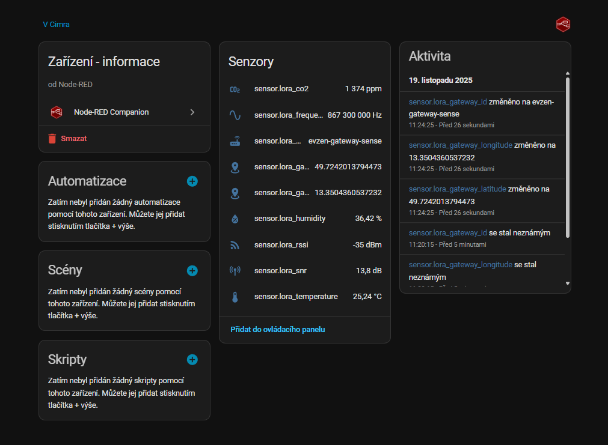

# Home Assistant LoRaWAN Example (TTN → MQTT → Node-RED → Home Assistant)

This example shows how to integrate the **LoRaWAN mode** of the LocuSense node
with **Home Assistant**, using:

- LoRaWAN end device (LocuSense node with Wio-E5)
- LoRaWAN gateway
- **The Things Network (TTN)** as LoRaWAN network server
- **MQTT** as transport from TTN to your Home Assistant
- **Node-RED add-on** inside Home Assistant to:
  - parse TTN JSON messages
  - create Home Assistant sensors via `node-red-contrib-home-assistant-websocket`

Data path is:

```text
Node → LoRa → Gateway → TTN → MQTT → Node-RED → Home Assistant
```

> ⚠️ This README only covers the **LoRaWAN path**. Matter/Thread and the ESP32‑C6
> firmware are documented separately in the Matter README.

> Firmware context: [`firmware/stm32/README.md`](../../firmware/stm32/README.md) describes the STM32 state machine,
> while [`firmware/esp32c6/README.md`](../../firmware/esp32c6/README.md) covers the ESP32-C6 bridge. For a hardware overview see the
> [project root README](../../README.md).


If you decide to run the **Matter over Thread** workflow instead, jump to the [Home Assistant Matter guide](../matter/README.md) which covers ESP32-C6 commissioning, Thread network setup and dashboard examples that complement the LoRaWAN flow described here.

### Repository assets in this folder

- `lora_ttn_ha_flow.json` – Node-RED flow imported in section 6.
- Screenshots referenced here live under `../../docs/images/` (shared with the Matter guide).

---

## 1. Requirements

- A running **Home Assistant** instance
- **Node-RED add-on** installed in Home Assistant
- TTN account + application + at least one registered device (your LocuSense node)
- LoRaWAN gateway connected to TTN
- Basic familiarity with:
  - TTN Console
  - MQTT
  - Node-RED
  - Home Assistant entities / dashboards

On the LoRaWAN side this example has been tested with:

- **Frequency plan**: `Europe 863-870 MHz (SF9 for RX2 - recommended)`
- **LoRaWAN version**: `LoRaWAN 1.0.1`
- **Regional Parameters version**: `TS001 1.0.1`

### Firmware / console checklist

- Flash the **STM32 LoRaWAN build** and in the console run
  `SET comms_mode 1` (alias `SET comms 1`) to select `COMMS_LORA`.
- Run `SHOW` (or `GET`) in the console to double-check that `comms_mode = COMMS_LORA`
  and that Matter-specific toggles stay disabled.
- Optional sanity check: `WIO SHOW` echoes the current App/Dev EUIs and confirms the module
  responds before you move on to TTN provisioning.

---

## 2. Configure the LocuSense node (OTAA)

The LocuSense node uses **OTAA** (Over-The-Air Activation). You need three
values from TTN:

- `AppEUI` (a.k.a. `JoinEUI`) – 16 hex characters
- `DevEUI` – 16 hex characters
- `AppKey` – 32 hex characters

> Make sure the firmware is in **`COMMS_LORA`** mode (`SET comms_mode 1`
> in the STM32 console) so that the LoRaWAN stack is active before you proceed.
> A full console command reference lives in `firmware/stm32/README.md`
> (see the *Configuration Console* section).

These are **stored in the LoRa communication module EEPROM** and configured
via the node's configuration console.

1. Connect the node over USB (USB–UART) to your PC.
2. Open a serial terminal (e.g. TeraTerm) at:
   - **Baud rate**: `115200`
   - **Data bits**: `8`
   - **Parity**: `None`
   - **Stop bits**: `1`
3. Enter **CONFIG mode** by holding the button for ~5 seconds at boot, then
   use commands like:

   ```text
   WIO SET APP_EUI <16-hex>
   WIO SET DEV_EUI <16-hex>
   WIO SET APP_KEY <32-hex>
   ```

4. Save configuration:

   ```text
   SAVE
   ```

A quick `WIO SHOW` printout should now show the newly stored OTAA keys. If you want to test connectivity before deploying, you can issue a manual `WIO JOIN` and watch the join status both in the console and in the TTN Application event log.

On next boot the node reads configuration from the EEPROM on the LoRa module,
joins the network via OTAA and begins periodic uplinks according to the
firmware configuration (measurement interval, thresholds, etc.).

---

## 3. TTN application & device

1. In **TTN Console**, create an **Application** or use an existing one.
2. Add a new device (end device) for your node:
   - LoRaWAN version: **1.0.1**
   - Regional params: **TS001 v1.0.1**
   - Frequency plan: **Europe 863‑870 MHz (SF9 for RX2 – recommended)**
3. Use the **OTAA** credentials (AppEUI, DevEUI, AppKey) you plan to flash
   into the node (see previous section).
4. After provisioning, you should be able to see **join requests / joins**
   and **uplink messages** in the TTN Console once the node starts sending.

---

## 4. Uplink payload formatter (temperature, humidity, CO₂)

The firmware sends a compact binary payload on **FPort 8**:

- Bytes 0–1: temperature × 100 (signed or unsigned, depending on FW)
- Bytes 2–3: humidity × 100
- Bytes 4–5: CO₂ in ppm

In the TTN Application **Payload formatters → Uplink**, select
**“Javascript”** and use:

```js
function Decoder(bytes, f_port) {
  var decoded = {};

  if (f_port === 8) {

    var temp_data = (bytes[0] << 8) | bytes[1];
    decoded.temperature = temp_data / 100;

    var hum_data = (bytes[2] << 8) | bytes[3];
    decoded.humidity = hum_data / 100;

    var co2_data = (bytes[4] << 8) | bytes[5];
    decoded.co2 = co2_data;

    return decoded;
  }

  return {};
}
```

In the **Live data** tab you should now see `decoded_payload.temperature`,
`decoded_payload.humidity` and `decoded_payload.co2` for each uplink.

---

## 5. MQTT access from Home Assistant / Node-RED

Home Assistant (Node-RED add-on) acts as an **MQTT client** and connects to
the **TTN MQTT broker**. TTN then pushes uplinks over this connection.

### 5.1 Create MQTT credentials in TTN

1. In TTN Console go to your **Application → Integrations → MQTT**.
2. Create / view your **MQTT connection details**:
   - **Server**: `eu1.cloud.thethings.network` (for EU1 region)
   - **Port**: `1883`
   - **Username**: something like `YOUR_APP_ID@ttn`
   - **Password**: a TTN **API key**, e.g. `NNSXS.XXXXXXXX...`

> Replace `YOUR_APP_ID` and `NNSXS.XXXXXXXX...` with your own values.  
> Do not hardcode your real password into public repositories.

### 5.2 Node-RED MQTT configuration

In the **Node-RED add-on** in Home Assistant:

1. Open the Node-RED editor.
2. Configure an **MQTT broker** node with:

   - **Server**: `eu1.cloud.thethings.network`
   - **Port**: `1883`
   - **Protocol**: MQTT v3.1.1
   - **Username**: `YOUR_APP_ID@ttn`
   - **Password**: `YOUR_TTN_MQTT_PASSWORD` (API key)
   - TLS: optional (configure according to TTN docs if you enable it).

3. The example flow subscribes to TTN uplinks using:

   ```text
   v3/YOUR_APP_ID@ttn/devices/+/up
   ```

   This pattern matches uplink messages from **all devices** in your
   application.

   

---

## 6. Node-RED flow: `lora_ttn_ha_flow.json`

This repository contains an example Node-RED flow in:

```text
home_assistant/lora/lora_ttn_ha_flow.json
```

Import it into Node-RED (menu → Import → paste JSON). Then adjust:

- MQTT broker settings (host, username, password)
- TTN Application ID (where relevant)
- Device-specific details if needed

### 6.1 What the flow does

The flow consists of three logical parts:

1. **MQTT input from TTN**  
   One or more **MQTT in** nodes subscribe to TTN topics, typically:

   - `v3/YOUR_APP_ID@ttn/devices/+/up` – for **uplinks**
   - Optionally `#` – for debugging all traffic

   The payload from TTN is a JSON object (`msg.payload`) with fields such as:

   - `uplink_message.decoded_payload.temperature`
   - `uplink_message.decoded_payload.humidity`
   - `uplink_message.decoded_payload.co2`
   - `uplink_message.rx_metadata[0].rssi`
   - `uplink_message.rx_metadata[0].snr`
   - `uplink_message.rx_metadata[0].gateway_ids.gateway_id`
   - `uplink_message.settings.frequency`
   - etc.

2. **Function node: `data parse`**  
   The function node:

   - Accepts both **TTN uplink JSON** and a simple HTTP JSON format
     (`{ temperature, humidity, co2 }`) for flexibility.
   - Ignores special packets with `frm_payload === "EQ=="` used by the
     optional time-sync mechanism.
   - Extracts and normalizes fields into a local `next` state:

     - `temperature`
     - `humidity`
     - `co2`
     - `rssi`
     - `snr`
     - `frequency`
     - `spreading_factor`
     - `bandwidth`
     - `gateway_id`
     - `gateway_eui`
     - `gateway_location` `{ latitude, longitude }`

   - Stores the most recent state in Node-RED **context** so that partial
     updates keep previous values.
   - Outputs a simplified `msg.payload` object for Home Assistant:

     ```json
     {
       "temperature": 23.4,
       "humidity": 42.1,
       "co2": 650,
       "rssi": -89,
       "snr": 7.5,
       "frequency": 868.3,
       "gateway_id": "your-gateway-id",
       "gateway_location": {
         "latitude": 50.0,
         "longitude": 14.0
       }
     }
     ```

3. **Home Assistant sensors (Node-RED Companion)**  
   The flow uses `node-red-contrib-home-assistant-websocket` nodes
   (`ha-sensor`) to publish the parsed values as **Home Assistant entities**.

   You should end up with entities like:

   - `sensor.lora_temperature` (°C)
   - `sensor.lora_humidity` (%)
   - `sensor.lora_co2` (ppm)
   - `sensor.lora_rssi` (dBm)
   - `sensor.lora_snr` (dB)
   - `sensor.lora_frequency` (Hz)
   - `sensor.lora_gateway_latitude`
   - `sensor.lora_gateway_longitude`
   - `sensor.lora_gateway_id`

   In Home Assistant, these will appear under a device such as
   **“Node-RED”** or **“Node-RED Companion”**, depending on how you
   configured the integration.

---

## 7. Optional: time synchronization via TTN downlink

The flow also contains an **optional** part that demonstrates how to use
TTN downlinks to synchronize the node's **RTC (Real-Time Clock)**:

- The node sends a special uplink with `frm_payload === "EQ=="` to request
  time.
- A Node-RED function node (`create timestamp`) listens to

  ```text
  v3/YOUR_APP_ID@ttn/devices/+/up
  ```

  and, when it sees that special payload, generates a 4-byte UNIX timestamp.

- The timestamp is encoded as base64 and sent back as a downlink using an
  MQTT topic of the form:

  ```text
  v3/YOUR_APP_ID@ttn/devices/YOUR_DEVICE_ID/down/replace
  ```

- The LocuSense node receives the downlink on the configured FPort and
  updates its internal RTC.

This mechanism is optional but useful if you want the node’s clock to be
synchronized without NTP or other external time sources.

---

## 8. Home Assistant: visualizing LoRa data

Once the flow is deployed and the node is active, you should see new
entities in **Home Assistant → Settings → Devices & Services → Devices**,
under the Node-RED device (or similar).

Typical entities:

- `sensor.lora_temperature`
- `sensor.lora_humidity`
- `sensor.lora_co2`
- `sensor.lora_rssi`
- `sensor.lora_snr`
- `sensor.lora_frequency`
- `sensor.lora_gateway_latitude`
- `sensor.lora_gateway_longitude`
- `sensor.lora_gateway_id`



You can then build a Lovelace dashboard view similar to the example used for
the Matter/Thread device, for example:

- line graphs for temperature / humidity / CO₂
- a gauge for CO₂ (e.g. 350–2500 ppm range)
- tiles showing RSSI/SNR and gateway information

If you keep both Matter and LoRa integrations in the same Home Assistant
instance, you can create a separate **“Lora”** view and compare both data
paths on one dashboard.

---

## 9. Tips & troubleshooting

- If you see uplinks in TTN but nothing in Node-RED:
  - check the MQTT credentials (username / API key)
  - verify the MQTT server: `eu1.cloud.thethings.network:1883`
  - make sure the MQTT in node subscribes to
    `v3/YOUR_APP_ID@ttn/devices/+/up`.
- If Node-RED receives messages but Home Assistant shows no entities:
  - open Node-RED debug nodes to see parsed payloads
  - check the Home Assistant server configuration in the
    `node-red-contrib-home-assistant-websocket` nodes
  - confirm that the Node-RED add-on has access to Home Assistant's WebSocket
    API.
- If CO₂, temperature or humidity appear as `0` or `null`:
  - verify the TTN payload formatter
  - check that the node really sends the payload on **FPort 8**.

With this setup you get a complete LoRaWAN → TTN → MQTT → Node-RED →
Home Assistant pipeline, fully integrated into your LocuSense ecosystem.
