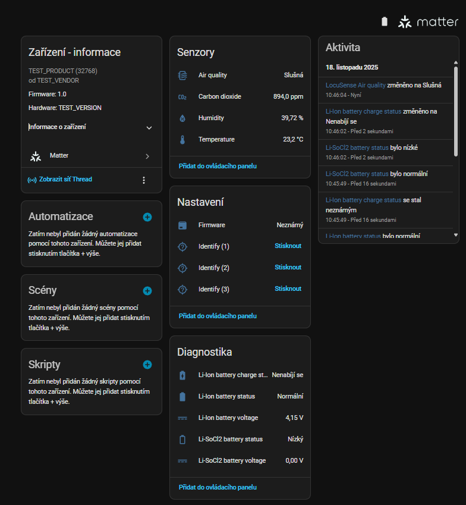
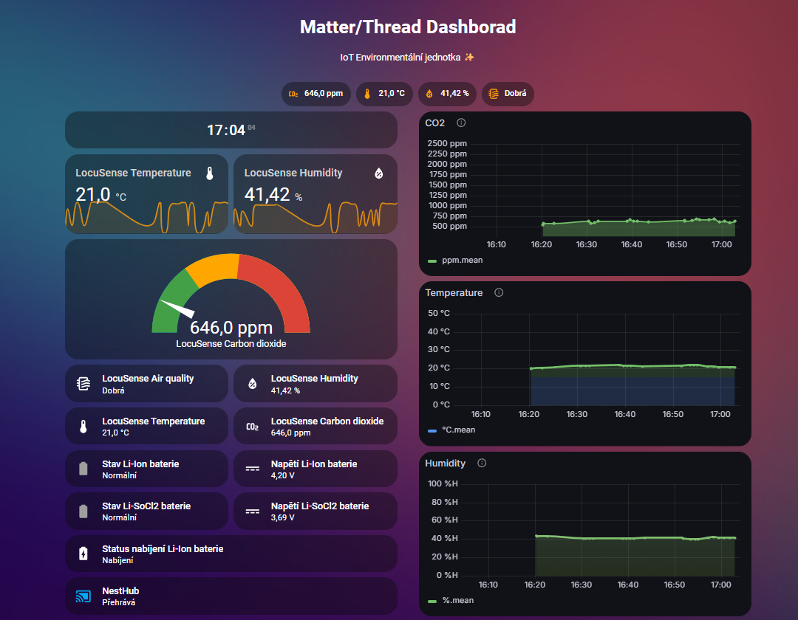

# Home Assistant integration (Matter over Thread)

This document describes how to integrate the **LocuSense environmental node** as a  
**Matter over Thread device** into Home Assistant and how to build a dashboard with  
history, InfluxDB and Grafana visualization.

> ℹ️ LoRaWAN / TTN integration is documented separately in the
> [Home Assistant LoRaWAN guide](../lora/README.md).

> 🔧 Firmware details for the STM32 baseboard and ESP32-C6 bridge live in
> [`firmware/stm32/README.md`](../../firmware/stm32/README.md) and
> [`firmware/esp32c6/README.md`](../../firmware/esp32c6/README.md). Visit those before commissioning
> if you need to rebuild or adjust either MCU.

### Repository assets in this folder

- `matter_dashboard.yaml` – full Lovelace dashboard referenced in section 5.
- `../../docs/images/*.png` – screenshots embedded below (kept in the shared docs folder).


---

## 1. Prerequisites

You will need:

- A running **Home Assistant** instance (OS / Supervised recommended).
- **Home Assistant Connect ZBT-1** (or equivalent Thread border router) properly set up.
- The LocuSense node configured as a **Matter over Thread environmental sensor**
  (ESP32-C6 firmware flashed and working).
- In the configuration console run `SET comms_mode 2` (value `COMMS_MATTER`)
  so that the STM32 side speaks to the ESP32-C6 co-processor.
- Optional but recommended:
  - **InfluxDB** add-on (for long-term storage)
  - **Grafana** add-on (for nice charts, embedded into Home Assistant)
  - Optional remote access via **Cloudflared** (HTTPS tunnel / reverse proxy)

---

## 2. Create and verify a Thread network

If you are using **Home Assistant Connect ZBT-1**, follow the official guides:

- Forming a Thread network with Connect ZBT-1  
  – see the vendor guide (Nabu Casa) for **forming a new Thread network**.
- Home Assistant docs: **Thread integration** and adding Thread devices.  

Make sure that after setup you can see a **Thread network** under:

> **Settings → Devices & services → Thread**

Check that:

- The ZBT-1 is **Online**.
- At least one **Thread network** is listed and **Active**.
- The ESP32-C6 node is in radio range of the border router.

---

## 3. Commission the LocuSense Matter device

The ESP32-C6 module exposes LocuSense as a **Matter environmental sensor** with
CO₂, temperature, humidity, air quality and dual-battery monitoring.

1. Put the device into **Matter commissioning mode**  
   (see `firmware/esp32c6/README.md` for the exact button/command).  
   Typically you will either:
   - Scan a **Matter QR code** shown on the E-Ink display / label, or  
   - Use a **numeric setup code**.
   - In the STM32 console you can confirm radio selection with `SHOW`
     (look for `comms_mode = COMMS_MATTER`) before attempting commissioning.

2. In Home Assistant, go to:

   > **Settings → Devices & services → Add integration → Matter**

3. Follow the on-screen wizard:
   - Select **Add Matter device**.
   - Scan the QR code or enter the pairing code.
   - Wait for the onboarding to finish and the device to appear.

4. After pairing, you should see a new device (e.g. `Test product`) with several entities
   (sensors and binary sensors).

---

## 4. Exposed entities (example)

The exact entity IDs will depend on your Matter firmware and HA naming, but a typical
setup exposes:

| Function                         | Example entity ID                          | Notes                              |
|----------------------------------|--------------------------------------------|------------------------------------|
| Temperature                      | `sensor.test_product_temperature`          | °C                                 |
| Relative humidity                | `sensor.test_product_humidity`             | %                                  |
| CO₂ concentration                | `sensor.test_product_carbon_dioxide`       | ppm                                |
| Air quality index / category     | `sensor.test_product_air_quality`          | Numeric or descriptive             |
| Li-Ion battery status (OK/fault) | `binary_sensor.test_product_battery_5`     | `on` = active / fault depends map  |
| Li-Ion battery voltage           | `sensor.test_product_battery_voltage_5`    | V                                  |
| Li-SoCl₂ battery status         | `binary_sensor.test_product_battery_6`     | Backup / long-term battery         |
| Li-SoCl₂ battery voltage        | `sensor.test_product_battery_voltage_6`    | V                                  |
| Charge state (Li-Ion)           | `sensor.test_product_battery_charge_state` | e.g. Charging / Charged / No USB   |

> Adjust the entity IDs in the examples below to match what you see in  
> **Settings → Devices & services → [your device] → Entities**.



---

## 5. Example Matter dashboard in Home Assistant

You can build a dedicated **Matter / Thread** view showing:

- Current CO₂, temperature, humidity, air quality.
- Battery state (Li-Ion + Li-SoCl₂).
- Short-term history of all values.
- Optional media player (e.g. Google Nest Hub) to visualize the data in the room.
- Embedded **Grafana** panels for more advanced charts.

### 5.1 Dashboard YAML

A complete example dashboard configuration is provided in:

> `home-assistant/matter_dashboard.yaml`

To use it:

1. In Home Assistant, create a new dashboard (or edit an existing one).
2. Click **⋮ → Edit dashboard → Raw configuration editor**.
3. Paste the content of `matter_dashboard.yaml` (adjust entity IDs as needed).
4. Save and reload the dashboard.

The example view includes:

- A digital clock
- Line graphs for:
  - `sensor.test_product_temperature`
  - `sensor.test_product_humidity`
- A CO₂ gauge:
  - Min: 350 ppm  
  - Max: 2500 ppm  
  - Green: 0–1000 ppm, Yellow: 1000–1500 ppm, Red: 1500+ ppm
- Tiles for all main sensors and batteries:
  - Temperature, humidity, CO₂, air quality
  - Li-Ion and Li-SoCl₂ battery status and voltage
  - Li-Ion charge state + history graph for charge state
- A second view for LoRa (if you use the LoRa node) is defined in the same file,  
  but is independent of Matter and can be removed if not needed.

---

## 6. InfluxDB integration

To store sensor values long-term, enable the **InfluxDB** add-on and configure
the Home Assistant integration.

### 6.1 Add-on configuration (example)

You can configure the InfluxDB add-on with TLS and authentication,
for example:

```yaml
auth: true
reporting: true
ssl: true
certfile: fullchain.pem
keyfile: privkey.pem
envvars: []
```

> ⚠️ Use your own certificates and credentials.  
> The exact paths and options depend on your environment.

### 6.2 `configuration.yaml` for InfluxDB

In your Home Assistant `configuration.yaml` add something like:

```yaml
influxdb:
  host: a0d7b954-influxdb
  port: 8086
  database: homeassistant
  username: YOUR_USERNAME
  password: YOUR_PASSWORD
  max_retries: 3
  default_measurement: state
```

- `host` can be the internal container name (e.g. when using HA OS add-ons) or
  the host running InfluxDB.
- Change the credentials and database name to your own.

For a more detailed walkthrough of integrating **Home Assistant + InfluxDB + Grafana**,  
see this guide:

- https://www.influxdata.com/blog/how-integrate-gafana-home-assistant/

---

## 7. Grafana integration

Grafana is used to visualize the time-series data from InfluxDB and embed
the charts as panels in the Home Assistant dashboard.

### 7.1 Local-only Grafana (no Cloudflare)

If you run Grafana **only on the local network**, the add-on can be configured
with a minimal set of environment variables such as:

```yaml
env_vars:
  - name: GF_SECURITY_ALLOW_EMBEDDING
    value: "true"
  - name: GF_AUTH_ANONYMOUS_ENABLED
    value: "true"
  - name: GF_AUTH_ANONYMOUS_ORG_ROLE
    value: Viewer
  - name: GF_SERVER_ROOT_URL
    value: http://homeassistant:3000/
  - name: GF_SERVER_SERVE_FROM_SUB_PATH
    value: "false"
plugins:
  - yesoreyeram-boomtheme-panel
custom_plugins: []
ssl: false
```

Notes:

- `GF_SECURITY_ALLOW_EMBEDDING` must be `true` to allow `<iframe>` embedding.
- `GF_AUTH_ANONYMOUS_ENABLED` lets the HA dashboard access Grafana without login
  (for the Viewer role only).
- Adjust `GF_SERVER_ROOT_URL` to match how you access Grafana from Home Assistant
  (`http://<your-ip>:3000/` or similar).
- Disable SSL (`ssl: false`) if you only use HTTP locally.

### 7.2 Optional: Grafana via Cloudflare tunnel

If you expose Grafana **publicly** through a tunnel / reverse proxy (e.g. the
**Cloudflared** add-on), you can set up something like:

```yaml
env_vars:
  - name: GF_SECURITY_ALLOW_EMBEDDING
    value: "true"
  - name: GF_AUTH_ANONYMOUS_ENABLED
    value: "true"
  - name: GF_AUTH_ANONYMOUS_ORG_NAME
    value: Main Org.
  - name: GF_AUTH_ANONYMOUS_ORG_ROLE
    value: Viewer
  - name: GF_SERVER_ROOT_URL
    value: https://grafana.example.com/
  - name: GF_SERVER_SERVE_FROM_SUB_PATH
    value: "false"
  - name: GF_SECURITY_ADMIN_USER
    value: admin
  - name: GF_SECURITY_ADMIN_PASSWORD
    value: STRONG_PASSWORD
  - name: GF_AUTH_DISABLE_LOGIN_FORM
    value: "false"
  - name: GF_SECURITY_COOKIE_SECURE
    value: "true"
  - name: GF_SECURITY_COOKIE_SAMESITE
    value: none
plugins:
  - yesoreyeram-boomtheme-panel
custom_plugins: []
ssl: true
certfile: fullchain.pem
keyfile: privkey.pem
```

And a Cloudflared configuration like:

```yaml
external_hostname: home.example.com
additional_hosts:
  - hostname: grafana.example.com
    service: http://a0d7b954-grafana:3000
```

> 🔒 If you expose Grafana to the internet, treat this as a development example only.  
> Use strong credentials, consider disabling anonymous access or restricting access
> to a VPN / specific IPs.

---

## 8. Embedding Grafana panels into Home Assistant

In the dashboard YAML (`matter_dashboard.yaml`) you can include Grafana panels as
`iframe` cards, for example:

```yaml
- type: iframe
  url: >-
    https://grafana.example.com/d-solo/YOUR_DASH_ID/your-panel
    ?orgId=1&panelId=1&from=now-1h&to=now&refresh=30s&kiosk=tv
  aspect_ratio: 45%
  card_mod:
    style: |
      :host {
        --ha-card-background: transparent;
      }
      ha-card {
        background: transparent !important;
        box-shadow: none !important;
      }
      ha-card > div,
      ha-card .card-content,
      ha-card iframe {
        background: transparent !important;
      }
```

You can also use a custom card such as `custom:addon-iframe-card` if you prefer,
as shown in the example YAML.

Make sure that:

- The **URL** matches your Grafana instance (local or tunneled).
- Grafana allows embedding (`GF_SECURITY_ALLOW_EMBEDDING=true`).
- Either anonymous access is enabled (Viewer role) or the iframe can authenticate.



---

## 9. Security and best practices

- Change all example usernames and passwords to your own.
- Use HTTPS and valid certificates for any externally exposed service.
- If you use anonymous Grafana access, keep it **read-only** and only for the
  organization/boards you actually want visible.
- Home Assistant, InfluxDB and Grafana should ideally live on a trusted network
  or behind a VPN if they hold sensitive sensor data.

---

## 10. Troubleshooting

**Matter device not visible in Home Assistant**

- Check that the Thread network is active and that Connect ZBT-1 is online.
- Make sure the node is in commissioning mode and close enough to the border router.
- Try removing and re-adding the device in **Settings → Devices & services → Matter**.

**Entities have different names than in the examples**

- Open the device page in HA and confirm the actual entity IDs.
- Edit the dashboard YAML and replace `sensor.test_product_*` with your IDs.

**Grafana iframe shows a blank page**

- Verify you can open the Grafana URL in a browser from the same network.
- Check `GF_SECURITY_ALLOW_EMBEDDING` and `GF_AUTH_ANONYMOUS_ENABLED`.
- If using HTTPS, ensure the certificate is trusted by the device running the browser.

**InfluxDB has no data**

- Check the Home Assistant logs for `influxdb` errors.
- Validate `host`, `port`, credentials and `database` in `configuration.yaml`.
- Confirm that the InfluxDB add-on is running.

---
